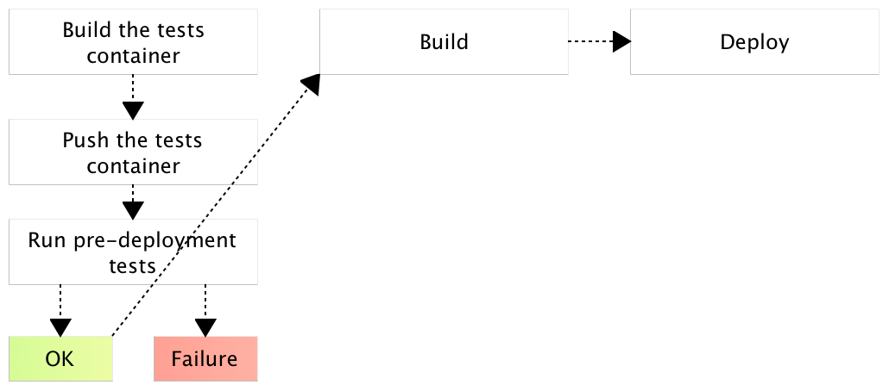

Chances are that you already tried Docker. You probably started by running one of the images from [Docker Hub](https://hub.docker.com/). The ease of use led you to experiment writing your own *Dockerfile* and building your own images. You tried [Docker Compose](https://www.docker.com/products/docker-compose). You might have realized benefits Docker provides in conjunction with microservices. Hopefully, you already deployed a container or two to production or, at least, realized advantages it brings to development, testing, integration and other environments and phases. All those pieces are necessary requirements for the "real deal". The final objective is to combine quite a few processes and technologies that will allow us to create a deployment pipeline. Docker allows us to reach nirvana. A world many thought is far from reality. A world where the last thing we do is run `git push`. From there on, machine takes over, and few minutes later our software is tested, built, deployed to production, and what so not. Let's see how that nirvana looks like. Let's explore which steps are required for a fully automated continuous deployment pipeline.

The Continuous Deployment Pipeline
==================================

What is the continuous deployment pipeline? In a nutshell, it is a set of steps executed on each CMS commit. The objective of the pipeline is to perform a set of tasks that will deploy a fully tested and functional service or application to production. To put it differently, the last human action is to make a commit to a repository and everything else is done automatically. With such a process we increase reliability by (partly) eliminating human error, and speed by letting machines do what they do best (running repeatable processes that do not require creative thinking). The reason why every commit is passed through the pipeline lies in the word *continuous*. If we postpone the process and, for example, run it at the end of a sprint, neither testing nor deployment would not be continuous. By postponing testing, and deployment to production, we are postponing potential discovery of problems and, as a result, increasing the effort required to correct them. Fixing something a month after the problem is introduced is more expensive then if only a week passed. Similarly, if only a few minutes elapsed between commiting the code and getting a notification of a bug, the time required to locate the culprit is almost negligible. Besides, it's not only about savings in maintenance and bug fixing. Continuous deployment allows us to get new features to production much faster. The less time it passes between a feature being developed and being available to our users, the faster we start gaining benefits from it. The result are happy users who get to use our new features sooner and, through that, an increase in profits.

Which steps should constitute the pipeline? Instead of answering that question directly, let us start with the absolute minimum and walk ourselves towards one possible solution. The minimum set of steps would be to test the service, built it, and deploy it. None of those tasks can be skipped. Without testing we have no guarantee that the service works, without building it there is nothing to deploy, and without deploying it our users have no benefits from the new release.

Testing
=======

Traditionally, we test software by running unit tests against the source code. While that gives us high code coverage, it does not (necessarily) prove that features we implemented are working as expected but that individual units of code (methods, functions, classes) are behaving as designed. To validate features, we add functional tests on top. They tend to be more oriented towards black-box testing and not directly related to the code behind them. The major problem functional tests pose are system dependencies. Java applications might require a specific JDK to be installed. We applications might need to be tested against a myriad of browsers. It is not uncommon to repeat the same set of tests with many different system combinations. The sad truth is that many do not have tests that are extensive enough to provide assurance that a release can be deployed to production without a human intervention. Even when tests are truly reliable, they are often not run under all the circumstances we expect to see in production. The reason behind that lies in the way we manage infrastructure. When managed manually, infrastructure is expensive to set up. How many servers would be need in order to setup all the browsers we expect our users to use? Ten? Hundred? What happens when one project has different runtime dependencies than the other? Most solved those problems by having different environments. One would run on Ubuntu while the other would have Red Hat. One would be with JDK8, while the other would host JDK7. That is very expensive, especially if those environments are static (as oposed to create and destroy approach through AWS). Even if we manage to setup all the server combinations, we are still facing the problem with speed and flexibility. If, for example, a team decides to develop a new service or refactor an existing one to a different stack, there might be a considerable time spent from requesting a new environment until it is fully operational. During that time, continuous deployment is on hold. When we add microservices to this mix, everything is exponentially multiplied. While we had only a few applications in the past, now we must deal tens, hundreds, or even thousands of services. After all, one of the benefits microservices bring to the table is flexibility to choose the best technology for a given use case and the release speed. We do not want, any more, to wait for the whole system to be developed, but release a functionality limited to a single microservice as soon as it's done. A single bottleneck is enough to reduce that speed to a crawl and, in many cases, that bottleneck is infrastructure.

Many of the testing problems can be easily fixed with Docker containers. Everything a service or an application needs in order to be tested can, and should, be inside a container. Take a look at the [Dockerfile.test](https://github.com/vfarcic/books-ms/blob/master/Dockerfile.test). It is the container used for testing a microservice that uses [Scala](http://www.scala-lang.org/) for back-end, [Polymer](https://www.polymer-project.org/1.0/) for front-end, and MongoDB as data store. It is fully self-sufficient service split from the rest of the system vertically. I won't go into details of that Dockerfile definition but list the things it has inside. It contains Git, NodeJS, Gulp, and Bower required for front-end. Scala, SBT, and MongoDB are required for the back-end. Part of the tests are using Chrome
and Firefox. The service source code and all dependencies are there as well. I'm not suggesting that you should choose this stack for your services but trying to point out that, in many cases, there are quite a lot of runtime and system dependencies our services need. Requesting a server with all that would, in best of cases, mean a long wait time until everything is set up. More likelly than not, after a dozen of similar requests for other services, we would start experiencing conflicts and problems. Servers are not made to host infinite number of potentially conflicting dependencies. We could use VMs dedicated for testing a single service but that would introduce quite a lot of wasted resources and slow initialization times. With Docker containers, this job is moved away from infrastructure teams and placed in hands of developers. They choose what their application needs during the testing phase, specify that in a Dockerfile and let their CD tool of choice build and run the container that will execute all the tests they need. Once tests are successfull, we can proceed to the next stage and build the service itself. The tests container should be pushed to a Docker registry (private or public) so that it can be reused in other occasions. Apart from benefits we already mentioned, when tests run is finished, container can be removed thus leaving the host server in the same state as it was before. That way, the same server (or a cluster of test servers) can be reused for testing all the services we are developing.

The diagram just got a bit more complex.

Show the final Dockerfile(s)
Show the final pipeline
