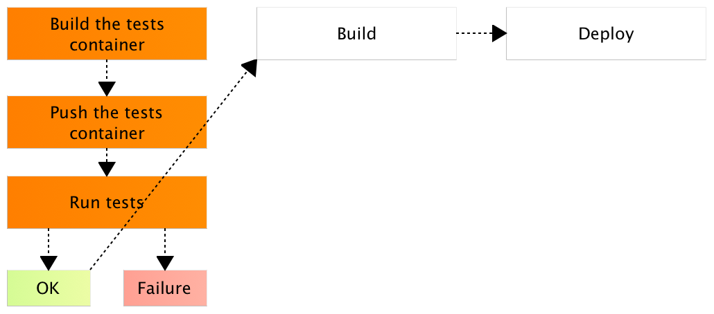
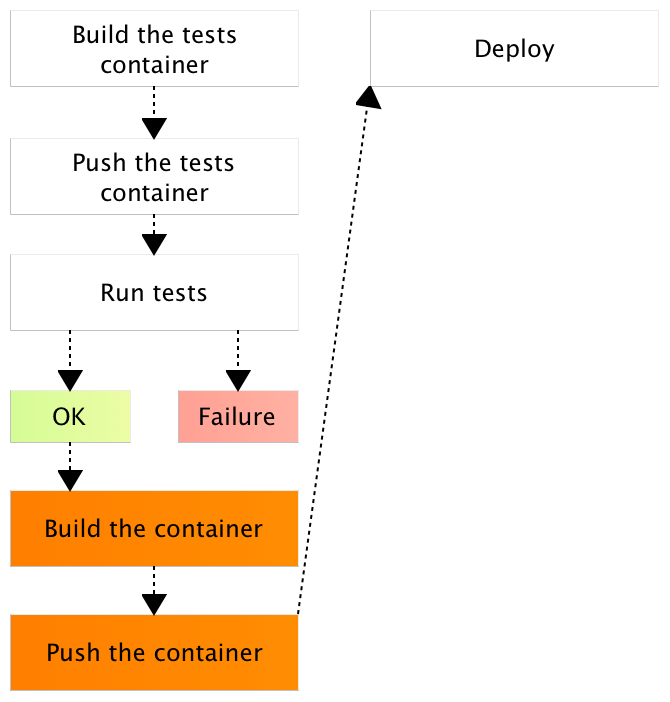
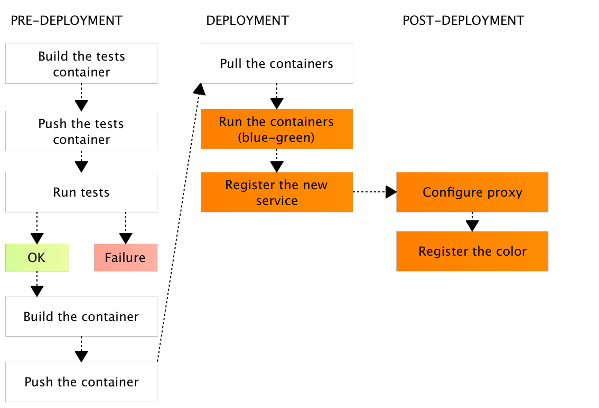
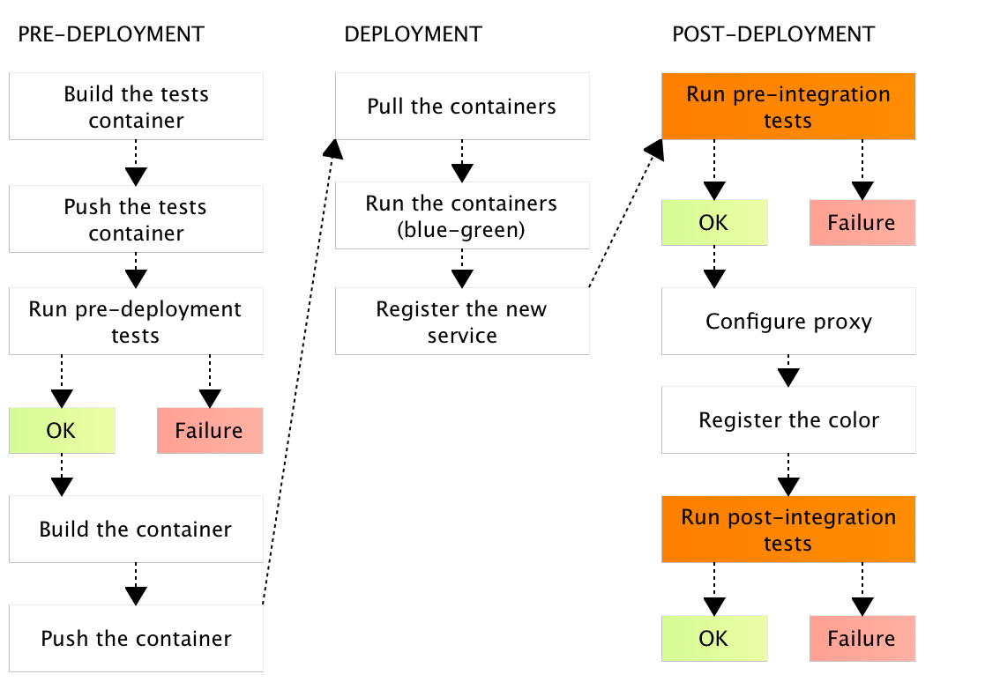
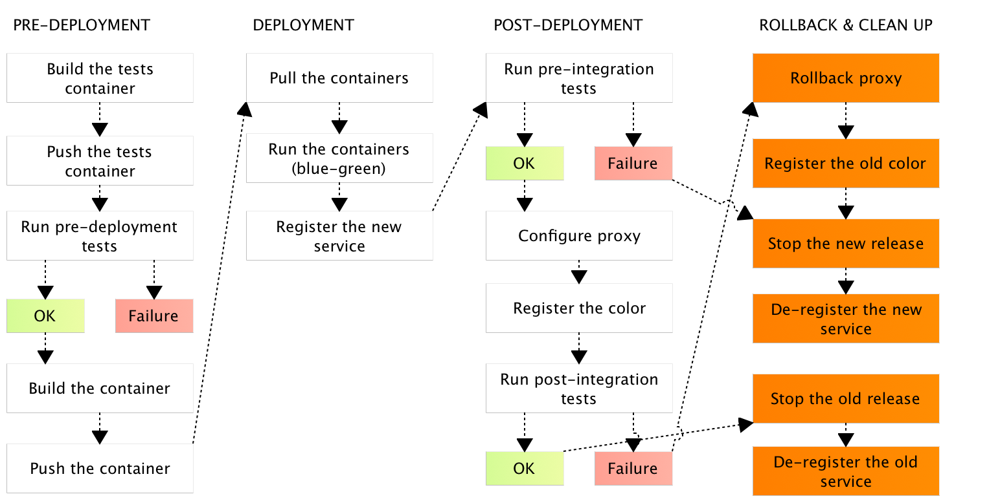

Chances are that you already tried Docker. You probably started by running one of the images from [Docker Hub](https://hub.docker.com/). The ease of use led you to experiment writing your own *Dockerfile* and building your own images. You tried [Docker Compose](https://www.docker.com/products/docker-compose). You might have realized benefits Docker provides in conjunction with microservices. Hopefully, you already deployed a container or two to production or, at least, realized advantages it brings to development, testing, integration and other environments and phases. All those pieces are necessary requirements for the "real deal". The final objective is to combine quite a few processes and technologies that will allow us to create a deployment pipeline. Docker allows us to reach nirvana. A world many thought is far from reality. A world where the last thing we do is run `git push`. From there on, machine takes over, and few minutes later our software is tested, built, deployed to production, and what so not. Let's see how that nirvana looks like. Let's explore which steps are required for a fully automated continuous deployment pipeline.

The Continuous Deployment Pipeline
==================================

What is the continuous deployment pipeline? In a nutshell, it is a set of steps executed on each CMS commit. The objective of the pipeline is to perform a set of tasks that will deploy a fully tested and functional service or application to production. To put it differently, the last human action is to make a commit to a repository and everything else is done automatically. With such a process we increase reliability by (partly) eliminating human error, and speed by letting machines do what they do best (running repeatable processes that do not require creative thinking). The reason why every commit is passed through the pipeline lies in the word *continuous*. If we postpone the process and, for example, run it at the end of a sprint, neither testing nor deployment would not be continuous. By postponing testing, and deployment to production, we are postponing potential discovery of problems and, as a result, increasing the effort required to correct them. Fixing something a month after the problem is introduced is more expensive then if only a week passed. Similarly, if only a few minutes elapsed between commiting the code and getting a notification of a bug, the time required to locate the culprit is almost negligible. Besides, it's not only about savings in maintenance and bug fixing. Continuous deployment allows us to get new features to production much faster. The less time it passes between a feature being developed and being available to our users, the faster we start gaining benefits from it. The result are happy users who get to use our new features sooner and, through that, an increase in profits.

Which steps should constitute the pipeline? Instead of answering that question directly, let us start with the absolute minimum and walk ourselves towards one possible solution. The minimum set of steps would be to test the service, built it, and deploy it. None of those tasks can be skipped. Without testing we have no guarantee that the service works, without building it there is nothing to deploy, and without deploying it our users have no benefits from the new release.

Testing
=======

Traditionally, we test software by running unit tests against the source code. While that gives us high code coverage, it does not (necessarily) prove that features we implemented are working as expected but that individual units of code (methods, functions, classes) are behaving as designed. To validate features, we add functional tests on top. They tend to be more oriented towards black-box testing and not directly related to the code behind them. The major problem functional tests pose are system dependencies. Java applications might require a specific JDK to be installed. We applications might need to be tested against a myriad of browsers. It is not uncommon to repeat the same set of tests with many different system combinations. The sad truth is that many do not have tests that are extensive enough to provide assurance that a release can be deployed to production without a human intervention. Even when tests are truly reliable, they are often not run under all the circumstances we expect to see in production. The reason behind that lies in the way we manage infrastructure. When managed manually, infrastructure is expensive to set up. How many servers would be need in order to setup all the browsers we expect our users to use? Ten? Hundred? What happens when one project has different runtime dependencies than the other? Most solved those problems by having different environments. One would run on Ubuntu while the other would have Red Hat. One would be with JDK8, while the other would host JDK7. That is very expensive, especially if those environments are static (as oposed to create and destroy approach through AWS). Even if we manage to setup all the server combinations, we are still facing the problem with speed and flexibility. If, for example, a team decides to develop a new service or refactor an existing one to a different stack, there might be a considerable time spent from requesting a new environment until it is fully operational. During that time, continuous deployment is on hold. When we add microservices to this mix, everything is exponentially multiplied. While we had only a few applications in the past, now we must deal tens, hundreds, or even thousands of services. After all, one of the benefits microservices bring to the table is flexibility to choose the best technology for a given use case and the release speed. We do not want, any more, to wait for the whole system to be developed, but release a functionality limited to a single microservice as soon as it's done. A single bottleneck is enough to reduce that speed to a crawl and, in many cases, that bottleneck is infrastructure.

Many of the testing problems can be easily fixed with Docker containers. Everything a service or an application needs in order to be tested can, and should, be inside a container. Take a look at the [Dockerfile.test](https://github.com/vfarcic/books-ms/blob/master/Dockerfile.test). It is the container used for testing a microservice that uses [Scala](http://www.scala-lang.org/) for back-end, [Polymer](https://www.polymer-project.org/1.0/) for front-end, and MongoDB as data store. It is fully self-sufficient service split from the rest of the system vertically. I won't go into details of that Dockerfile definition but list the things it has inside. It contains Git, NodeJS, Gulp, and Bower required for front-end. Scala, SBT, and MongoDB are required for the back-end. Part of the tests are using Chrome
and Firefox. The service source code and all dependencies are there as well. I'm not suggesting that you should choose this stack for your services but trying to point out that, in many cases, there are quite a lot of runtime and system dependencies our services need. Requesting a server with all that would, in best of cases, mean a long wait time until everything is set up. More likelly than not, after a dozen of similar requests for other services, we would start experiencing conflicts and problems. Servers are not made to host infinite number of potentially conflicting dependencies. We could use VMs dedicated for testing a single service but that would introduce quite a lot of wasted resources and slow initialization times. With Docker containers, this job is moved away from infrastructure teams and placed in hands of developers. They choose what their application needs during the testing phase, specify that in a Dockerfile and let their CD tool of choice build and run the container that will execute all the tests they need. Once tests are successfull, we can proceed to the next stage and build the service itself. The tests container should be pushed to a Docker registry (private or public) so that it can be reused in other occasions. Apart from benefits we already mentioned, when tests run is finished, container can be removed thus leaving the host server in the same state as it was before. That way, the same server (or a cluster of test servers) can be reused for testing all the services we are developing.

The diagram just got a bit more complex.

Building
========

Now that we run all kinds of tests, we can build the container that will, ultimately, be deployed to production. Since it is likelly that it will be deployed to a different server than the one where we are building it, we should also push it to a Docker registry.

Finally, once we tested and built the new release, we are ready to deploy it to the production server. All we have to do is pull the images and run the container.

Deploying
=========

That's it. We have our continuous deployment flow defined. We can start deploying our microservices after each commit and deliver new features to our users faster than ever. Business is happy and start showing us with awards and we go home knowing that we did something truly great and useful.

**The end**

The truth is that what we defined thus far is far from a complete continuous deployment flow. There are quite a few steps missing, things to consider, and paths to take. Let's start identifying and tackling problems one by one.

Safely Deploying Through Blue-Green Process
===========================================

Probably the most dangerous step we did is deployment. If we pull a new release and run it Docker Compose will replace the old with the new one. There will be some downtime. Docker needs to stop the old release, start the new one and your service needs to initialize. No matter whether this process lasts for a few minutes, few seconds, or even less than that, there is still some downtime. If you adopt microservices and continuous deployment, releases will be coming more often than before. You will be, eventually, deploying multiple times a day. No matter how often you release, interruption is always something that should be avoided.

The solution lies in *blue-green* deployments. If you are new to it, please read the [Blue-Green Deployment](http://technologyconversations.com/2016/02/08/blue-green-deployment/) article. In a nutshell, the process deploys a new release in parallel with the old one. One is called *blue* and the other is called *green*. Since both are running in parallel, there is no downtime (at least not due to the deployment process). Running both releases in parallel opens some new possibilities, but also creates a few challenges we haven't had before.

The first thing to consider when practicing blue-green deployment is how to redirect users traffic from the old release to the new one. Before we were simply replacing one release with the other so both would be running on the same server and the same port. Now, since both are running in parallel, ports need to be different. Chances are your are already using some kind of a proxy service (nginx, HAProxy, and so on). The new challenge is that the proxy cannot be static any more. It's configuration is continuously changing with each new release. If we are deploying to a cluster, things get even more complicated. Not only that ports are changing but also IPs. In order to use a cluster effectivelly, services should be deployed to a server that is most suited at that moment. The criteria that decides which server is most suited should be based on available memory, type of hard disk, CPU, and so on. That way, we can distribute services in a much better way and greatly optimize the usage of our available resources. That poses two problems. The first one is how to find out IPs and ports of services we are deploying. The answer lies in service discovery.

In a nutshell, service discovery consists of three parts. We need a service registry where we store service information. Then, we need to have a process in place that will register new services and de-register those that are stopped. Finally, we need to have a way to retrieve service information. For example, when we deploy a new release, registration process should store the IP and the port in service registry. Later on, nginx can discover that information and use it to reconfigure itself. Some of the commonly used tools are *etcd*, *Consul*, and *Zookeeper* as registry, *Registrator* for registering and de-registering services, and *confd*, and *Consul Template* for service discovery and templating. For more information about service discovery and those tools, please read the [Service Discovery: Zookeeper vs etcd vs Consul](http://technologyconversations.com/2015/09/08/service-discovery-zookeeper-vs-etcd-vs-consul/) article.

Now that we have a mechanism to store and retrieve service information and can use it to reconfigure the proxy, the only question left unanswered (for now) is which color to deploy. When deploying manually, we know that the previous color was, for example, green and that the next one should be blue. When everything is automated, we need to have that information stored somewhere and available from the deployment flow. Since we already established that service discovery as part of the process, we can register the color together with service IP and port and retrieve that information when needed.

Having all that into the account, the flow is as displayed in the following diagram. Since the number of steps is increasing, I split them into pre-deployment, deployment, and post-deployment groups.

Running Pre-Integration and Post-Integration Tests
==================================================

You might have noticed that the first step in the deployment flow was to run tests. While they are very important and give us confidence that the code is (probably) working as expected, they do not verify that the service we deployed to production is truly working as expected. There are many things that could have gone wrong. Maybe we did not set up database correctly, maybe firewalls are preventing access to the service, and so on. The list of things that might prevent the service from working correctly in production is far from short. The fact that we think that our code is working as expected is not the same as verification whether what we deployed is properly configured. Even if we set up a staging server, deploy our service inside it, and run another round of tests, cannot give us full confidence that the same results will always be found in production. In order to distinguish different types of tests, we'll call those we defined earlier *pre-deployment tests*. I'm intentionally avoiding to give them more concrete name since the type of tests you'll run in this early stage depends from one project to another. They can be unit tests, functional tests, and so on. No matter the type, what they all have in common is that they are run before the service is built and deployed.

The blue-green process we defined earlier opens a new opportunity. Since both the old and the new release of the same service is running in parallel, we have a window of opportunity to test the later before we reconfigure the proxy to point to it. That way, we can safelly deploy the new release to production and test it while, at the same time, our users will continue being redirected to the old release through the proxy. I tend to call them *pre-integration tests*. The name might not be the best one since many are used to a different meaning of the word *integration tests*. In this specific case, it means that those tests are run before the integration of the new release with the proxy service (before the proxy is re-configured). Those tests allow us to skip staging environments (they are never fully the same as production) and test the new release under *exactly* the same setting as the one users will be using when proxy is re-configured. Well, the word *exactly* is not fully accurate because the only difference is that we'll test the service without the proxy and our users should not be allowed to access it by any other way but through it. As with pre-deployment tests, the result of pre-integration tests can be a signal to proceed with the flow or to abort the process in case of a failure.

Finally, after we re-configure the proxy, we should run another run of testing, this time called *post-integration tests*. Those should be very fast since the only thing left to verify is whether proxy was indeed configured correctly. That usually means only a few tests that make a requests on ports 80 (*HTTP*) and 443 (*HTTPS*). As with any other type of tests, they can be successful or failed.

Please note that, once we adopt Docker, those tests should all be run as containers, in the same way we run pre-deployment testing. The benefits are the same and, in many cases, the same testing container can be used for all testing types. I tend to simply pass and environment variable that indicates which types of tests should be run.

Rolling Back and Cleaning Up
============================

Before we revisit *OK* and *failure* outcomes of the tests steps, let us define the desired state of the production environment. The logic is simple. If any part of the flow fails, the environment should be in exactly the same state as if the process was not even initiated. Apart from triggering some form of notifications of the problem and creating a culture where fixing the culprit is of utmost importance and priority, there is not much more to be done. The problem is that rollback is often not as easy as it sounds. Fortunately, Docker containers make that task easier than any other approach since there are very few side effects on the environment itself.

The decision what to do with *pre-deployment tests* results is easy. Nothing was deployed so we can either continue with the flow or stop it. On the other hand, the steps executed before we reached the result of *pre-integration tests* did leave the production environment in an undesirable state. The new release (blue or green) has been deployed and should be removed. That removal should be followed by removal of any data generated by that release. Since, at that point, proxy is still pointing to the old release, our users will continue using it and continue their lives oblivious that any attempt to deploy new features has been made. The last set of tests adds additional obstacles. Since proxy has been changed to point to the new release, such a change needs to be reverted. The same holds true for the registration of the color that was deployed.

Please note that we discussed only failures cause by tests. That does not mean that other steps of the flow cannot fail. They can and the similar logic should be applied. No matter what fails, the environment needs to be reverted to the state it was before.

Even if everything went as planned, there is still some cleaning up to be done. The old release should be stopped and de-registered.

I skipped mentioning databases. They probably pose the major challenge during the rollback stage. The subject is too big for an article so I'll just state, what I consider to be the main rule. Always make sure that schema changes that accompany the new release are backwards compatible and make sure that there is an extensive set of tests that confirms it. They must be run during the *pre-deployment tests* phase or the risk of reaching the point with no return is too big. I often receive complains that backwards compatibility is not feasible. While that is true in some cases, more often than not, that opinion comes from the waterfall era when teams were making releases once a month or even once a year. If deployment flow cycle is short and is performed on every commit (assuming that we do not commit less often than once a day), the changes that should be applied to databases as, generally, small enough that backwards compatibility can be accomplished with relative ease.

TODO
====

* Discuss where is each step run
* Explain that some of the pieces (but not all) are parts of Kubernetes and Mesos
* Show the final Dockerfile(s)
* Show the final pipeline
